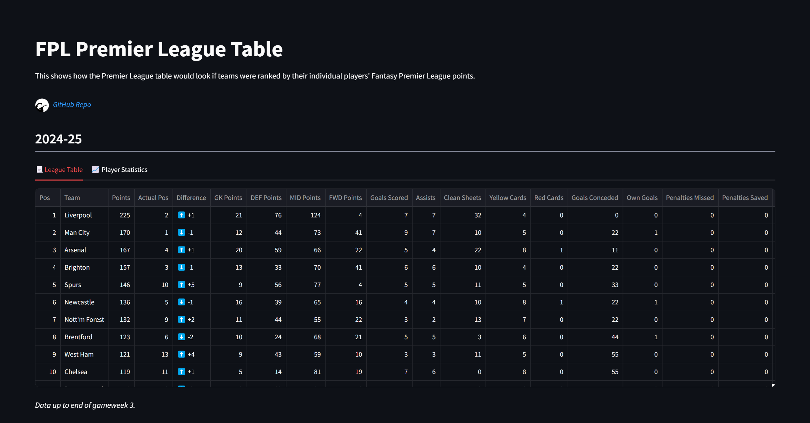

# FPL Premier League Table

### Overview
This shows how the Premier League table would look if it was ranked by their individual players Fantasy Premier League points.

### Hosted Dashboard Location
https://fpl-pl-table.streamlit.app/


### Local Instructions
Python Version: 3.11.7

Clone this repo and install requirements (in virtual environment)

Run the Streamlit app:
```
streamlit run streamlit_app.py
```

Run the Dash app:
```
python dash_app.py
```

Navigate to local host: http://127.0.0.1:8050/.


## Dashboard Preview
